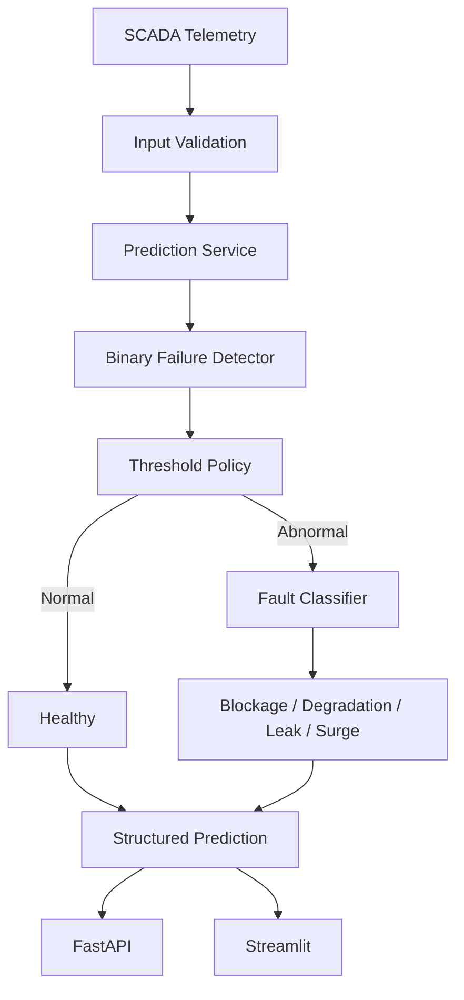

# Pipeline Failure Detection AI

Pipeline Failure Detection AI is a two-stage machine-learning portfolio system for SCADA telemetry. It first detects abnormal pipeline operation, then classifies abnormal observations as blockage, degradation, leak, or surge. The same leakage-safe inference path powers a Streamlit monitoring dashboard and a FastAPI service.

## What It Does

```text
SCADA telemetry → input validation → binary failure detection → threshold policy
                                                               ├─ normal → healthy
                                                               └─ abnormal → fault classification
                                                                                 ↓
                                                                     FastAPI / Streamlit
```

- Replays real observations by pipeline segment in chronological order.
- Detects normal versus abnormal operation using eight SCADA features.
- Runs fault classification only when the active threshold declares an abnormal condition.
- Supports standard and high-sensitivity monitoring modes.
- Exposes single and batch inference through FastAPI.
- Preserves group-aware evaluation so segments never cross train/test boundaries.

## System Architecture



Both fitted artifacts contain preprocessing and classification in one scikit-learn pipeline. Models are loaded once per application lifecycle, and presentation layers call the shared inference service rather than reproducing transformations or prediction logic.

## Model Performance

### Binary failure detector

Official held-out pipeline segments:

| Metric | Result |
|---|---:|
| Failure precision | 88.5% |
| Failure recall | 93.1% |
| F1 | 90.8% |
| PR-AUC | 97.2% |

Repeated segment-group validation:

| Metric | Mean ± standard deviation |
|---|---:|
| Failure recall | 88.1% ± 4.1% |
| F1 | 89.6% ± 3.2% |

### Fault classifier

| Evaluation | Result |
|---|---:|
| Official held-out macro F1 | 97.3% |
| Official balanced accuracy | 96.9% |
| Group-aware CV macro F1 | 97.2% ± 2.0% |

Detailed comparisons, validation summaries, error analyses, feature importance, and plots are retained under `artifacts/` as portfolio evidence. These results come from a small simulated-style dataset and are not production-performance claims.

## Leakage Prevention

The predictive inputs are:

```text
pressure, flow_rate, temperature, valve_status,
pump_state, pump_speed, compressor_state, energy_consumption
```

The following are forbidden as model features:

- `event_type`: perfectly maps normal events to target 0 and fault events to target 1.
- `alarm_triggered`: strongly encodes an existing alarm outcome and creates severe leakage risk.
- `target`: the prediction label.
- `timestamp`: ordering metadata only.
- `segment_id`: grouping and response metadata only.

Pydantic rejects labels and alarm fields at the API boundary. Dashboard evaluation mode attaches ground truth only after prediction. Automated tests verify that inference receives exactly the eight approved fields.

## Monitoring Modes

| Mode | Threshold | Validation tradeoff |
|---|---:|---|
| Standard | 0.50 | Higher precision and fewer false alerts |
| High Sensitivity | 0.30 | Higher recall and substantially more false alerts |

Out-of-fold analysis measured 89.5% recall and 92.5% precision at 0.50, compared with 95.2% recall and 76.4% precision at 0.30. The alternate mode changes only the decision threshold; it does not modify the saved model.

## Dashboard

```bash
streamlit run app.py
```

The dashboard provides segment replay, timestamp navigation, SCADA trends, failure and fault predictions, alert severity, standard/high-sensitivity modes, session history, and an optional evaluation-only ground-truth panel. It replays stored data and does not imply a live industrial SCADA connection.

## FastAPI

```bash
uvicorn api.main:app --reload
```

Interactive documentation: `http://127.0.0.1:8000/docs`

Endpoints:

- `GET /health` — process liveness
- `GET /ready` — model-service readiness
- `GET /model-info` — validated safe metadata
- `POST /predict` — single observation
- `POST /predict/batch` — up to 1,000 observations

Every response carries an `X-Request-ID`. Application logs are structured JSON and avoid telemetry payloads, model contents, and local filesystem paths.

## Tests

```bash
python -m compileall src api
pytest -q
```

The ordinary suite uses deterministic SCADA-like fixtures and the committed joblib pipelines. It validates software behavior and real model integration without reading `data/raw/` or redistributing the Kaggle dataset.

## Full Dataset Verification

The external dataset is intentionally separate from CI. Place the SCADA Pipeline Operations Dataset CSV under:

```text
data/raw/
```

Then run:

```bash
python -m src.full_dataset_verification
```

This verifies schema, 1,000 rows, 50 segments, 17 timestamps, target/event distributions, and compatibility with both saved pipelines. It does not retrain either model.

## CI

`.github/workflows/ci.yml` configures GitHub Actions to install direct dependencies, compile `src` and `api`, and run the complete pytest suite on pushes and pull requests. CI is self-contained: it needs the source, metadata, and two compact model artifacts, but no Kaggle credentials, secrets, or raw dataset download.

The workflow is configured locally; this README does not claim it has run on GitHub yet.

## Dataset

This project uses the **SCADA Pipeline Operations Dataset** from Kaggle. The raw dataset is not redistributed in this repository. Users should obtain it from its Kaggle dataset page and review the applicable terms there; no explicit dataset license is documented locally.

## Project Structure

```text
api/                       FastAPI application, schemas, middleware, errors
artifacts/                 Final evaluation tables, reports, and plots
data/raw/                  External Kaggle CSV; ignored by Git
docs/images/               Reserved for future real screenshots
models/                    Two fitted pipelines and safe metadata
src/                       Training, validation, inference, and services
tests/                     Deterministic software and model integration tests
.github/workflows/ci.yml   Compile and pytest workflow
app.py                     Streamlit dashboard
requirements.txt           Direct project dependencies
```

## Limitations

- 1,000 observations and only 306 abnormal samples.
- 50 segments and 17 timestamps, representing roughly 17 minutes.
- Simulated/synthetic-style characteristics and unusually separable telemetry patterns.
- Strong results may partly reflect dataset-generation artifacts.
- No live industrial SCADA integration or prospective field validation.
- No authentication, production rate limiting, or distributed serving layer.
- This is an ML portfolio prototype, not an operational safety system.

## Tech Stack

Python 3.11, Pandas, NumPy, scikit-learn, Joblib, FastAPI, Pydantic, Uvicorn, Streamlit, Matplotlib, Pytest, and GitHub Actions.
